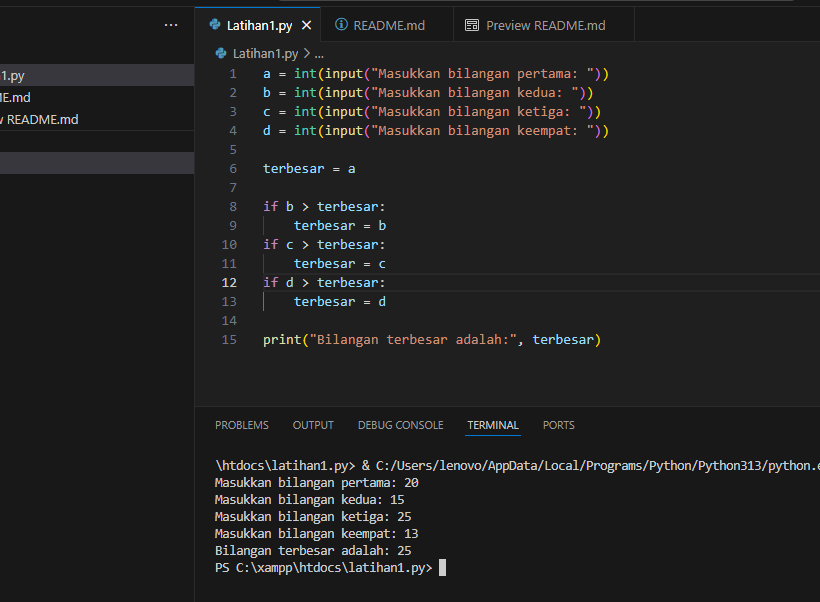

# NAMA  : AGUS SALEH RUMBOUW
# NIM   : 312510465
# KELAS : TI.25.A.2
# MATKUL: PENGANTAR PEMROGRAMAN

## Latihan1
## menentukan bilangan terbesar dari 4 bilangan menggunakan statement if
## Tujuan
<pre>Membuat program Python sederhana yang meminta input 4 bilangan, kemudian menentukan bilangan yang paling besar menggunakan statement if.</pre>

## Lankah Lankah Pembuatanya
<pre>1. Buka VS Code di laptop jika sudah terinstall dan python 
   Buatkan folder project baru dengan nama misalkan 'latihan1.py'
2. buat file pyton dan didalam nama file itu misalkan nama filenya "latihan1.py"
3. Tuliskan kode berikut ke dalam file "latihan1.py"
4. setelah itu jalankan proramnya di bagian terminal, tekan titik tiga masuk ke terminal dan jalankan terminal baru.
5. terakhir tentukan bilangan besar dari ke 4 bilangan yang di masukan
   <b> Contoh Seperti Gambar Dibawah</b></pre>

# Selesai